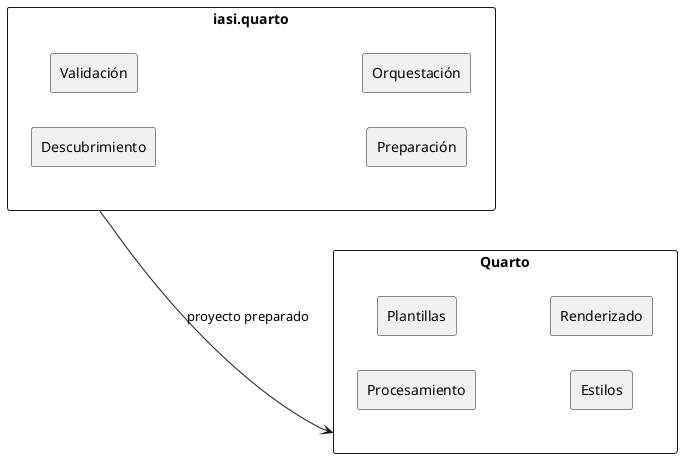
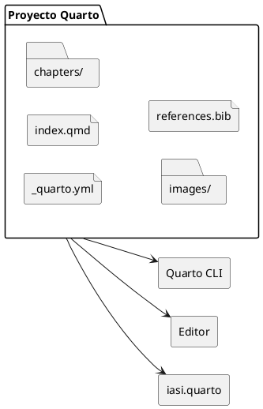

`iasi.quarto` está construido sobre Quarto.

No introduce un nuevo formato documental ni sustituye el proceso de publicación de Quarto. Los archivos continúan siendo documentos `.qmd`, la configuración sigue expresándose mediante YAML y los formatos finales son generados por Quarto.

Esta relación permite utilizar `iasi.quarto` sin abandonar el ecosistema original.

```{.plantuml}
@startuml
top to bottom direction

rectangle "Proyecto documental" as project
rectangle "iasi.quarto" as iasi
rectangle "Proyecto Quarto preparado" as prepared
rectangle "Quarto" as quarto
rectangle "HTML" as html
rectangle "PDF" as pdf

project --> iasi
iasi --> prepared
prepared --> quarto
quarto --> html
quarto --> pdf
@enduml
```

La idea central es sencilla:

> `iasi.quarto` organiza y prepara. Quarto renderiza.

## Qué hace Quarto

Quarto es el motor de publicación.

Entre otras tareas, se encarga de:

- interpretar los documentos `.qmd`;
- aplicar la configuración definida en `_quarto.yml`;
- ejecutar el código incluido en los documentos;
- resolver referencias, citas, figuras y tablas;
- aplicar temas, plantillas y estilos;
- generar formatos como HTML y PDF.

Un proyecto utilizado por `iasi.quarto` continúa siendo un proyecto Quarto y puede renderizarse directamente con sus herramientas habituales:

```bash
quarto render
```

`iasi.quarto` no altera ese principio.

## Qué añade iasi.quarto

En un libro Quarto, la estructura de la publicación se declara normalmente en `_quarto.yml`.

Por ejemplo:

```yaml
book:
  chapters:
    - index.qmd
    - chapters/01-intro.qmd
    - chapters/02-installation.qmd
    - chapters/03-usage.qmd
```

Esta configuración es clara y suficiente para publicaciones pequeñas. Sin embargo, a medida que un proyecto crece, mantener manualmente la relación de capítulos, partes y documentos puede convertirse en una tarea repetitiva y propensa a errores.

`iasi.quarto` añade una capa de convenciones y automatización que permite deducir parte de esa estructura a partir de la organización del proyecto.

Su trabajo consiste en:

- descubrir los documentos que forman la publicación;
- interpretar su organización;
- comprobar que la estructura sea coherente;
- preparar la configuración que necesita Quarto;
- coordinar la generación de uno o varios formatos.

## Separación de responsabilidades

La separación entre ambas herramientas es deliberada.



Quarto controla:

- el modelo documental;
- los formatos de salida;
- los motores de ejecución;
- las plantillas;
- los estilos;
- el proceso de renderizado.

`iasi.quarto` controla:

- las convenciones de organización;
- el descubrimiento de contenido;
- la validación de la estructura;
- la preparación de la publicación;
- la coordinación de libros y formatos.

Esta división evita duplicar capacidades que Quarto ya resuelve correctamente.

## Un proyecto sigue siendo un proyecto Quarto

Adoptar `iasi.quarto` no encierra la publicación en un formato propietario.

El resultado preparado continúa utilizando archivos reconocibles por Quarto:



Esto permite:

- utilizar directamente la línea de comandos de Quarto;
- trabajar con las extensiones habituales del editor;
- conservar temas y configuraciones existentes;
- integrar otras extensiones de Quarto;
- dejar de utilizar `iasi.quarto` sin convertir los documentos.

`iasi.quarto` añade una capa sobre el proyecto, pero no se apropia de él.

## Cuándo resulta útil

La automatización aporta más valor cuando:

- la publicación contiene muchos capítulos;
- los documentos cambian de posición con frecuencia;
- existen varios libros en un mismo repositorio;
- deben generarse varios formatos;
- se desea aplicar una organización uniforme;
- el proyecto debe poder crecer sin mantener manualmente listas extensas.

En publicaciones pequeñas, la ventaja principal es la sencillez.

En publicaciones grandes, la ventaja es mantener bajo control una estructura que, de otro modo, acabaría dispersa entre directorios, nombres de archivos y configuración YAML.

En el siguiente capítulo veremos cómo instalar `iasi.quarto` y comprobar que Quarto y R están correctamente disponibles.
