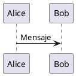

## Configurar la extensión

La extensión PlantUML se incorpora a la publicación desde la configuración de Quarto.

La configuración recomendada se declara en `_quarto.yml`:

```yaml
filters:
  - extensions/plantuml/plantuml.lua

filter-options:
  plantuml:
    enabled: true
    server: http://localhost:1025
    format: png
    cache: true
    styles:
      - resources/plantuml/iasi.puml
```

Esta declaración tiene dos partes:

```text
filters
  carga el filtro Lua

filter-options
  configura su comportamiento
```

El filtro debe cargarse antes de que sus opciones puedan aplicarse.

## Ruta del filtro

La entrada:

```yaml
filters:
  - extensions/plantuml/plantuml.lua
```

indica la ubicación del filtro respecto a la raíz de la publicación.

La estructura esperada puede ser:

```text
publication/
├── _quarto.yml
├── extensions/
│   ├── core/
│   └── plantuml/
│       ├── plantuml.lua
│       ├── compiler.lua
│       └── defaults.lua
└── resources/
    └── plantuml/
        └── iasi.puml
```

La extensión PlantUML utiliza módulos comunes situados en:

```text
extensions/core/
```

Por tanto, no debe copiarse únicamente `plantuml.lua`.

Debe conservarse la estructura completa de la extensión y de su núcleo compartido.

## `enabled`

La propiedad:

```yaml
enabled: true
```

activa el procesamiento de bloques PlantUML.

Cuando su valor es `false`, la extensión no debe compilar los bloques.

```yaml
filter-options:
  plantuml:
    enabled: false
```

Esta opción permite conservar la configuración y desactivar temporalmente la integración sin retirar el filtro de `_quarto.yml`.

La configuración habitual es:

```yaml
enabled: true
```

## `server`

La propiedad `server` contiene la URL base del servidor PlantUML.

```yaml
server: http://localhost:1025
```

No debe incluirse el segmento de formato:

```text
/png
/svg
```

La extensión lo añade al construir la petición.

La URL debe señalar únicamente la raíz del servicio:

```text
correcto
  http://localhost:1025

incorrecto
  http://localhost:1025/png
```

Para un servidor compartido:

```yaml
server: http://plantuml.local:1025
```

La dirección debe ser accesible desde el proceso que ejecuta Quarto.

Esto es especialmente importante cuando la construcción ocurre dentro de:

```text
una máquina virtual
un contenedor
un agente de integración continua
otro equipo de la red
```

En esos entornos, `localhost` representa el propio entorno de ejecución, no necesariamente la máquina anfitriona.

## `format`

La configuración recomendada utiliza:

```yaml
format: png
```

El flujo resultante es:

```text
PlantUML
  -> PNG
  -> mediabag de Pandoc
  -> HTML o PDF
```

La salida PNG evita que la construcción PDF dependa de una conversión posterior desde SVG.

Aunque la arquitectura conserva la validación de formatos admitidos por el compilador, la implementación actual de la plataforma normaliza la salida efectiva a PNG.

Por tanto, la configuración de usuario debe expresar también:

```yaml
format: png
```

Así, la configuración declarada coincide con el comportamiento real del pipeline.

## `cache`

La propiedad:

```yaml
cache: true
```

activa la reutilización de diagramas ya compilados.

Cuando la caché está activa:

```text
misma fuente preparada
misma configuración relevante
misma versión de la extensión
  -> misma entrada de caché
```

El servidor solo vuelve a utilizarse cuando cambia la identidad del diagrama o cuando la entrada almacenada ya no está disponible.

Para desactivar temporalmente la caché:

```yaml
cache: false
```

Esto puede resultar útil durante el diagnóstico de un servidor o de una modificación del compilador.

No es la configuración recomendada para el trabajo habitual.

## `styles`

La propiedad `styles` declara los archivos PlantUML que deben incorporarse a cada diagrama.

```yaml
styles:
  - resources/plantuml/iasi.puml
```

Puede contener más de un archivo:

```yaml
styles:
  - resources/plantuml/base.puml
  - resources/plantuml/architecture.puml
```

Los archivos se procesan en el orden declarado.

```text
base.puml
  -> architecture.puml
  -> fuente del diagrama
```

La extensión lee esos recursos y los inserta después de la declaración `@startuml`.

Una fuente como:



se prepara conceptualmente como:


El archivo indicado debe existir y ser legible durante la construcción.

La ruta se interpreta dentro del contexto de la publicación, por lo que conviene mantener los estilos bajo una ubicación estable:

```text
resources/plantuml/
```

## Configuración mínima

La configuración mínima necesita el filtro y un servidor:

```yaml
filters:
  - extensions/plantuml/plantuml.lua

filter-options:
  plantuml:
    enabled: true
    server: http://localhost:1025
    format: png
```

Sin estilos:

```text
el diagrama conserva la presentación predeterminada de PlantUML
```

Sin caché explícita:

```text
se aplica el valor definido por la extensión
```

Para que el proyecto sea legible y reproducible, es preferible declarar las opciones importantes de forma explícita.

## Configuración recomendada

La configuración completa recomendada es:

```yaml
filters:
  - extensions/plantuml/plantuml.lua

filter-options:
  plantuml:
    enabled: true
    server: http://localhost:1025
    format: png
    cache: true
    styles:
      - resources/plantuml/iasi.puml
```

Esta combinación expresa todas las decisiones relevantes:

```text
la extensión está activa
el servidor es local
la salida es PNG
la caché está habilitada
la publicación comparte un estilo
```

## Configuración por entorno

La URL del servidor puede variar entre equipos.

Por ejemplo:

```text
desarrollo local
  http://localhost:1025

red interna
  http://plantuml.local:1025

integración continua
  http://plantuml:8080
```

No conviene fijar en una guía reutilizable el nombre concreto de una máquina personal.

La configuración debe describir el servicio desde el punto de vista del entorno que ejecuta la publicación.

Cuando varios perfiles de Quarto necesitan direcciones diferentes, la opción puede colocarse en la configuración correspondiente al entorno.

La configuración común debe mantenerse en `_quarto.yml`, y únicamente las diferencias deben desplazarse a perfiles específicos.

## Opciones de bloque

La infraestructura permite que determinados atributos del bloque reemplacen opciones globales para un diagrama concreto.

Las opciones reconocidas por el motor son:

```text
server
format
cache
```

Un bloque puede declarar, por ejemplo:

````qmd
```{.plantuml cache="false"}
@startuml
Alice -> Bob: Prueba sin caché
@enduml
```
````

Esta capacidad debe utilizarse con moderación.

La configuración global mantiene una publicación coherente. Las excepciones por bloque son apropiadas para pruebas o necesidades muy localizadas, no para sustituir una configuración común bien definida.

En la implementación actual, la salida efectiva continúa normalizándose a PNG.

## Configuración HTML y PDF

La extensión se ejecuta antes de que Quarto genere el formato final.

Por eso puede utilizarse la misma configuración para ambos perfiles:

```text
_quarto.yml
  -> extensión PlantUML
  -> imagen PNG

_quarto-html.yml
  -> HTML

_quarto-pdf.yml
  -> PDF
```

No es necesario declarar un servidor PlantUML diferente para HTML y PDF cuando ambos se construyen en el mismo entorno.

Tampoco es necesario mantener dos copias del estilo.

La configuración compartida pertenece a `_quarto.yml`.

## Comprobar la configuración

Después de guardar `_quarto.yml`, deben comprobarse tres elementos.

Primero, que el servidor responde:

```bash
curl http://localhost:1025
```

Segundo, que las rutas existen:

```text
extensions/plantuml/plantuml.lua
resources/plantuml/iasi.puml
```

Tercero, que un documento contiene al menos un bloque PlantUML válido:

````qmd
```{.plantuml}
@startuml
Alice -> Bob: Verificación
@enduml
```
````

Después puede construirse HTML:

```r
build(
  format = "html"
)
```

Y, una vez verificado:

```r
build(
  format = "pdf"
)
```

## Errores de configuración habituales

### El filtro no existe

```text
extensions/plantuml/plantuml.lua
```

debe coincidir con la ruta real.

Un cambio de nombre o una copia incompleta impide cargar la extensión.

### El servidor incluye `/png`

La opción debe ser:

```yaml
server: http://localhost:1025
```

No:

```yaml
server: http://localhost:1025/png
```

La extensión construye la ruta final.

### El estilo no puede leerse

Una ruta como:

```yaml
styles:
  - resources/plantuml/iasi.puml
```

debe señalar un archivo existente.

La extensión detiene la compilación cuando no puede leer un estilo declarado.

### `localhost` apunta al lugar equivocado

Desde un contenedor o una máquina virtual, `localhost` puede no ser el equipo donde se ejecuta PlantUML.

Debe utilizarse una dirección accesible desde el entorno de construcción.

### La configuración declara SVG

La plataforma utiliza actualmente PNG como salida efectiva.

La configuración recomendada debe mantener:

```yaml
format: png
```

para evitar una discrepancia entre lo declarado y lo generado.

## Contrato de configuración

La extensión necesita conocer:

```text
si debe ejecutarse
dónde está el servidor
qué formato debe producir
si puede reutilizar la caché
qué estilos debe incorporar
```

Estas decisiones pertenecen a la publicación, no a cada documento individual.

> `_quarto.yml` conecta el contenido PlantUML con la infraestructura que lo convierte en una imagen reproducible.
