## Escribir diagramas

Los diagramas PlantUML se escriben directamente dentro de los documentos `.qmd`.

La forma básica es un bloque de código con la clase `plantuml`:

````qmd
```{.plantuml}
@startuml
Alice -> Bob: Mensaje
@enduml
```
````

La extensión reconoce el bloque, envía su contenido al servidor y sustituye el código por la imagen generada.

```text
bloque .plantuml
  -> fuente PlantUML
  -> compilación
  -> imagen dentro del documento
```

El diagrama aparece en la misma posición en la que se declaró el bloque.

## Estructura mínima

Cada bloque debe contener una fuente PlantUML válida.

La estructura mínima es:

```plantuml
@startuml
...
@enduml
```



`@startuml` abre el diagrama.

`@enduml` lo cierra.

Entre ambas declaraciones se escribe su contenido.

Por ejemplo:

````qmd
```{.plantuml}
@startuml
Cliente -> Servicio: Solicitud
Servicio --> Cliente: Respuesta
@enduml
```
````

La extensión no inventa ni corrige la sintaxis PlantUML.

Cuando el servidor no puede interpretar la fuente, la construcción debe detenerse con el error correspondiente.

## Primer diagrama

Este es un ejemplo completo:

```{.plantuml}
@startuml
actor Usuario
participant Aplicacion
participant Servicio

Usuario -> Aplicacion: Ejecutar operación
Aplicacion -> Servicio: Solicitud
Servicio --> Aplicacion: Resultado
Aplicacion --> Usuario: Respuesta
@enduml
```

Su fuente es:

````qmd
```{.plantuml}
@startuml
actor Usuario
participant Aplicacion
participant Servicio

Usuario -> Aplicacion: Ejecutar operación
Aplicacion -> Servicio: Solicitud
Servicio --> Aplicacion: Resultado
Aplicacion --> Usuario: Respuesta
@enduml
```
````

El mismo bloque se utiliza para HTML y PDF.

No es necesario mantener una versión distinta para cada formato.

## Diagramas de secuencia

Los diagramas de secuencia representan interacciones ordenadas en el tiempo.

```{.plantuml}
@startuml
actor Autor
participant "iasi.quarto" as IASI
participant Quarto
participant "PlantUML Server" as PlantUML

Autor -> IASI: build()
IASI -> Quarto: render
Quarto -> PlantUML: compilar diagrama
PlantUML --> Quarto: PNG
Quarto --> Autor: publicación
@enduml
```

La fuente:

````qmd
```{.plantuml}
@startuml
actor Autor
participant "iasi.quarto" as IASI
participant Quarto
participant "PlantUML Server" as PlantUML

Autor -> IASI: build()
IASI -> Quarto: render
Quarto -> PlantUML: compilar diagrama
PlantUML --> Quarto: PNG
Quarto --> Autor: publicación
@enduml
```
````

Pueden utilizarse:

```text
actores
participantes
mensajes síncronos
respuestas
activaciones
fragmentos condicionales
bucles
notas
```

Conviene mantener los nombres coherentes con el vocabulario utilizado en el texto.

## Diagramas de componentes

Los diagramas de componentes muestran piezas de un sistema y sus dependencias.

```{.plantuml}
@startuml
left to right direction

component "Documento .qmd" as Document
component "Filtro Lua" as Filter
component "Servidor PlantUML" as Server
component "Quarto" as Quarto

Document --> Filter
Filter --> Server
Server --> Filter
Filter --> Quarto
@enduml
```

La fuente:

````qmd
```{.plantuml}
@startuml
left to right direction

component "Documento .qmd" as Document
component "Filtro Lua" as Filter
component "Servidor PlantUML" as Server
component "Quarto" as Quarto

Document --> Filter
Filter --> Server
Server --> Filter
Filter --> Quarto
@enduml
```
````

Los alias:

```plantuml
component "Documento .qmd" as Document
```

permiten utilizar una etiqueta legible en el diagrama y un identificador breve en las relaciones.

```plantuml
Document --> Filter
```

Esta práctica mejora la legibilidad cuando los nombres contienen espacios o son demasiado largos.

## Diagramas de actividad

Los diagramas de actividad son útiles para describir procesos y decisiones.

```{.plantuml}
@startuml
start

:Leer configuración;
:Descubrir publicaciones;

if (¿Proyecto válido?) then (sí)
  :Preparar estructura;
  :Renderizar;
else (no)
  :Mostrar errores;
endif

stop
@enduml
```

La fuente:

````qmd
```{.plantuml}
@startuml
start

:Leer configuración;
:Descubrir publicaciones;

if (¿Proyecto válido?) then (sí)
  :Preparar estructura;
  :Renderizar;
else (no)
  :Mostrar errores;
endif

stop
@enduml
```
````

Este tipo de diagrama resulta apropiado para:

```text
pipelines
procesos de validación
flujos de decisión
procedimientos operativos
ciclos de construcción
```

No debe utilizarse para sustituir una explicación necesaria.

El diagrama resume el flujo. El texto explica su significado y sus condiciones.

## Diagramas de despliegue

Los diagramas de despliegue representan dónde se ejecutan los componentes.

```{.plantuml}
@startuml
node "Equipo de desarrollo" {
  component R
  component Quarto
  component "iasi.quarto" as IASI
}

node "Contenedor Docker" {
  component "PlantUML Server" as Server
}

R --> IASI
IASI --> Quarto
Quarto --> Server : HTTP
@enduml
```

La fuente:

````qmd
```{.plantuml}
@startuml
node "Equipo de desarrollo" {
  component R
  component Quarto
  component "iasi.quarto" as IASI
}

node "Contenedor Docker" {
  component "PlantUML Server" as Server
}

R --> IASI
IASI --> Quarto
Quarto --> Server : HTTP
@enduml
```
````

Este tipo de representación permite distinguir:

```text
componentes lógicos
procesos
máquinas
contenedores
servicios de red
dependencias externas
```

## Orientación

PlantUML elige automáticamente una disposición, pero puede indicarse una orientación general.

Horizontal:

```plantuml
left to right direction
```

Vertical:

```plantuml
top to bottom direction
```

Ejemplo:

````qmd
```{.plantuml}
@startuml
left to right direction

rectangle Fuente
rectangle Compilador
rectangle Imagen

Fuente --> Compilador
Compilador --> Imagen
@enduml
```
````

La orientación debe elegirse según la estructura del diagrama y el espacio disponible en la publicación.

Para PDF, los diagramas demasiado anchos pueden perder legibilidad al ajustarse al ancho de página.

## Alias y nombres visibles

Los elementos pueden tener un nombre visible y un alias interno.

```plantuml
rectangle "Servidor PlantUML" as PlantUML
rectangle "Extensión Lua" as Extension

Extension --> PlantUML
```

Esto evita repetir etiquetas largas:

```text
nombre visible
  Servidor PlantUML

alias utilizado en la fuente
  PlantUML
```

Los alias también ayudan a mantener estable la fuente cuando cambia una etiqueta editorial.

## Etiquetas en las relaciones

Las relaciones pueden describirse:

```plantuml
Extension --> PlantUML : solicitud HTTP
PlantUML --> Extension : imagen PNG
```

Las etiquetas deben aportar información que no resulte obvia por los nombres de los elementos.

Una relación sin contenido adicional puede mantenerse sin texto:

```plantuml
R --> iasi.quarto
```

Una relación con significado operacional debería nombrarlo:

```plantuml
Quarto --> PlantUML : compilar diagrama
```

## Notas

PlantUML permite añadir notas:

```plantuml
note right of PlantUML
  Devuelve una imagen PNG
end note
```

Ejemplo completo:

````qmd
```{.plantuml}
@startuml
rectangle Quarto
rectangle PlantUML

Quarto --> PlantUML : fuente

note right of PlantUML
  La instancia puede ser
  local o compartida
end note
@enduml
```
````

Las notas son útiles para aclaraciones breves.

Cuando una explicación necesita varios párrafos, debe permanecer en el texto del documento y no dentro del diagrama.

## Separar significado y apariencia

Los bloques deben concentrarse en:

```text
elementos
relaciones
orden
agrupaciones
mensajes
decisiones
```

La apariencia común debe vivir en los archivos de estilo configurados para la publicación.

No conviene repetir en cada bloque:

```text
colores corporativos
tipografías
grosores de borde
configuración visual general
```

La fuente del diagrama describe qué representa.

El estilo compartido decide cómo se presenta.

## Un diagrama por bloque

Cada bloque `.plantuml` debe representar un único diagrama.

```text
un bloque
  -> una fuente
  -> una imagen
  -> una entrada de caché
```

No debe utilizarse un único bloque para producir varios diagramas independientes.

Separarlos permite:

```text
colocarlos junto al texto correspondiente
reutilizar la caché de forma precisa
detectar qué fuente produjo cada imagen
mantener cambios pequeños y revisables
```

## Ubicación dentro del documento

El diagrama debe situarse cerca del texto que explica.

Una secuencia natural es:

```text
introducción del concepto
diagrama
explicación de sus elementos
consecuencias o detalles
```

Evite acumular todos los diagramas al final de un documento.

El objetivo no es crear una galería, sino integrar cada representación en el argumento técnico.

## Tamaño y complejidad

Un diagrama legible no intenta contener todo el sistema.

Cuando el número de elementos crece demasiado, conviene dividirlo por perspectiva:

```text
visión general
componentes principales
flujo de una operación
despliegue
detalle de un subsistema
```

Una publicación puede contener varios diagramas relacionados, cada uno con una pregunta clara.

```text
¿qué componentes existen?
¿cómo se comunican?
¿dónde se ejecutan?
¿qué ocurre durante una operación?
```

Cada pregunta puede requerir una representación diferente.

## Nombres estables

Los nombres utilizados en los diagramas deben coincidir con los nombres empleados en:

```text
el texto
la configuración
el código
otros diagramas
```

No conviene llamar al mismo elemento:

```text
PlantUML Server
servidor de diagramas
motor gráfico
servicio UML
```

sin una razón explícita.

La coherencia terminológica convierte los diagramas en parte de la documentación, no en ilustraciones aisladas.

## Caracteres y codificación

Los documentos y los archivos de estilo deben guardarse en UTF-8.

Esto permite utilizar correctamente:

```text
acentos
eñes
símbolos
etiquetas en castellano
```

Por ejemplo:

```plantuml
actor "Usuario técnico" as Usuario
Usuario -> Sistema: Validación
```

Cuando aparecen caracteres incorrectos, deben revisarse:

```text
la codificación del archivo .qmd
la codificación del archivo .puml
la respuesta del servidor
la fuente utilizada por PlantUML
```

## Opciones por bloque

Un bloque puede incluir atributos reconocidos por la extensión.

Por ejemplo, para evitar temporalmente la caché:

````qmd
```{.plantuml cache="false"}
@startuml
Alice -> Bob: Compilación nueva
@enduml
```
````

Las opciones globales continúan viniendo de `_quarto.yml`.

Las opciones por bloque deben utilizarse únicamente cuando un diagrama necesita una excepción concreta.

El capítulo dedicado a la caché explica con más detalle su comportamiento.

## Prueba mínima

Después de configurar la extensión, cree un documento con:

````qmd
## Prueba de PlantUML

```{.plantuml}
@startuml
Alice -> Bob: Funciona
Bob --> Alice: PNG generado
@enduml
```
````

Construya HTML:

```r
build(
  format = "html"
)
```

Después construya PDF:

```r
build(
  format = "pdf"
)
```

El mismo diagrama debe aparecer en ambos resultados.

## Criterio práctico

Un bloque PlantUML correcto debe cumplir cuatro condiciones:

```text
la fuente es válida
el diagrama responde a una pregunta concreta
los nombres coinciden con el resto de la documentación
la complejidad permite leerlo en HTML y PDF
```

> Un buen diagrama no contiene más información. Contiene la información adecuada, colocada donde el texto la necesita.
