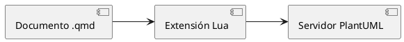
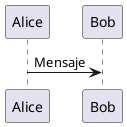

## Estilos compartidos

La extensión puede incorporar uno o varios archivos PlantUML a todos los diagramas de una publicación.

La configuración recomendada utiliza:

```yaml
filter-options:
  plantuml:
    styles:
      - resources/plantuml/iasi.puml
```

El archivo:

```text
resources/plantuml/iasi.puml
```

centraliza la apariencia común de los diagramas.

```text
documentos .qmd
  -> estructura y significado

iasi.puml
  -> apariencia compartida
```

Esta separación evita repetir reglas visuales dentro de cada bloque.

## Estructura recomendada

Una publicación puede organizar los recursos PlantUML así:

```text
publication/
├── _quarto.yml
├── resources/
│   └── plantuml/
│       └── iasi.puml
└── chapters/
    ├── 01-intro/
    └── 02-fundamentals/
```

La ruta declarada en `_quarto.yml` debe coincidir con la ubicación real:

```yaml
styles:
  - resources/plantuml/iasi.puml
```

El archivo debe estar disponible durante la construcción y guardado en UTF-8.

## Qué pertenece al estilo

Un archivo compartido puede definir:

```text
colores
tipografía
bordes
fondos
sombras
espaciado
apariencia de flechas
estilo de actores
estilo de componentes
estilo de nodos
convenciones visuales
```

Por ejemplo:

```plantuml
skinparam backgroundColor transparent
skinparam shadowing false
skinparam defaultFontName Arial

skinparam ArrowColor #5B4B3A
skinparam ArrowThickness 1

skinparam RectangleBackgroundColor #F3EBDD
skinparam RectangleBorderColor #5B4B3A
skinparam RectangleFontColor #2D261F

skinparam ComponentBackgroundColor #F3EBDD
skinparam ComponentBorderColor #5B4B3A
skinparam ComponentFontColor #2D261F
```

Este contenido es únicamente un ejemplo de estructura.

Los colores, fuentes y convenciones definitivos pertenecen a la identidad visual de cada publicación.

## Qué debe permanecer en el diagrama

El bloque `.plantuml` debe describir el contenido concreto:



No debería repetir reglas generales como:

```plantuml
skinparam shadowing false
skinparam defaultFontName Arial
skinparam ComponentBackgroundColor #F3EBDD
```

Cuando esas reglas aparecen en cada documento:

```text
aumenta la duplicación
los diagramas pueden divergir
los cambios visuales exigen editar muchos archivos
la fuente pierde legibilidad
```

El diagrama debe concentrarse en elementos y relaciones.

## Cómo se aplica el estilo

Antes de compilar un diagrama, la extensión lee los archivos configurados.

Después inserta su contenido inmediatamente después de la línea `@startuml`.

Una fuente original:



se prepara conceptualmente como:


El servidor recibe la fuente ya preparada.

Por tanto, el estilo forma parte de la compilación y también influye en la identidad utilizada por la caché.

```text
cambia el estilo
  -> cambia la fuente preparada
  -> cambia la imagen generada
```

## Varios archivos de estilo

La opción `styles` admite más de un archivo:

```yaml
styles:
  - resources/plantuml/base.puml
  - resources/plantuml/iasi.puml
  - resources/plantuml/architecture.puml
```

La extensión los lee en el orden declarado.

```text
base.puml
  -> iasi.puml
  -> architecture.puml
  -> contenido del diagrama
```

Este orden permite construir estilos por capas.

Por ejemplo:

```text
base.puml
  reglas generales

iasi.puml
  identidad visual de la publicación

architecture.puml
  convenciones específicas para diagramas técnicos
```

Cuando dos archivos modifican la misma propiedad, la regla aplicada posteriormente puede reemplazar a la anterior según el comportamiento de PlantUML.

El orden debe ser deliberado y estable.

## Un único archivo o varios

Para una publicación pequeña, un solo archivo suele ser suficiente:

```text
resources/plantuml/iasi.puml
```

Cuando las reglas crecen, pueden separarse por responsabilidad:

```text
resources/plantuml/
├── base.puml
├── sequence.puml
├── components.puml
└── deployment.puml
```

La separación resulta útil cuando:

```text
las reglas tienen ámbitos claros
varios libros comparten una base
existen convenciones por tipo de diagrama
los archivos siguen siendo fáciles de localizar
```

No conviene fragmentar el estilo sin una necesidad real.

Demasiados archivos convierten una decisión visual sencilla en una pequeña arqueología de includes.

## Estilo base recomendado

Un punto de partida sencillo podría ser:

```plantuml
skinparam backgroundColor transparent
skinparam shadowing false
skinparam roundcorner 8

skinparam defaultFontName Arial
skinparam defaultFontSize 13
skinparam defaultFontColor #2D261F

skinparam ArrowColor #5B4B3A
skinparam ArrowFontColor #2D261F

skinparam RectangleBackgroundColor #F3EBDD
skinparam RectangleBorderColor #5B4B3A

skinparam ComponentBackgroundColor #F3EBDD
skinparam ComponentBorderColor #5B4B3A

skinparam ActorBorderColor #5B4B3A
skinparam ActorFontColor #2D261F
```

El objetivo no es decorar cada elemento.

El objetivo es conseguir que todos los diagramas pertenezcan visualmente a la misma publicación.

## Estilos por tipo de elemento

PlantUML permite configurar familias concretas.

### Rectángulos

```plantuml
skinparam RectangleBackgroundColor #F3EBDD
skinparam RectangleBorderColor #5B4B3A
skinparam RectangleFontColor #2D261F
```

### Componentes

```plantuml
skinparam ComponentBackgroundColor #F3EBDD
skinparam ComponentBorderColor #5B4B3A
skinparam ComponentFontColor #2D261F
```

### Secuencias

```plantuml
skinparam ParticipantBackgroundColor #F3EBDD
skinparam ParticipantBorderColor #5B4B3A
skinparam ParticipantFontColor #2D261F

skinparam LifeLineBorderColor #8A735C
skinparam SequenceArrowColor #5B4B3A
```

### Actividades

```plantuml
skinparam ActivityBackgroundColor #F3EBDD
skinparam ActivityBorderColor #5B4B3A
skinparam ActivityFontColor #2D261F
```

No todas las publicaciones necesitan configurar todos los tipos.

Deben añadirse reglas cuando existe un diagrama real que las utiliza.

## Colores semánticos

Un estilo puede definir convenciones visuales con significado.

Por ejemplo:

```text
componente interno
  tono neutro

sistema externo
  tono distinto

error
  tono de alerta

artefacto generado
  borde discontinuo
```

Sin embargo, estas convenciones deben aplicarse de forma consistente.

Un mismo color no debería significar:

```text
servicio externo en un diagrama
error en otro
base de datos en un tercero
```

La identidad gráfica sirve para reducir esfuerzo cognitivo, no para fabricar un acertijo cromático.

## Macros y convenciones reutilizables

El archivo `.puml` también puede definir macros para elementos frecuentes.

Por ejemplo:

```plantuml
!define INTERNAL_COMPONENT(name, alias) component "name" as alias
!define EXTERNAL_COMPONENT(name, alias) component "name" as alias <<External>>
```

Y después:

```plantuml
@startuml
INTERNAL_COMPONENT(API, Api)
EXTERNAL_COMPONENT(Proveedor, Provider)

Api --> Provider
@enduml
```

Las macros pueden reducir repetición cuando representan una convención real del proyecto.

Deben utilizarse con moderación.

Una macro demasiado abstracta puede ocultar la sintaxis y dificultar que otro autor comprenda el diagrama.

## Estereotipos

Los estereotipos permiten aplicar estilos diferenciados.

Por ejemplo, en el archivo compartido:

```plantuml
skinparam component {
  BackgroundColor #F3EBDD
  BorderColor #5B4B3A
}

skinparam component<<External>> {
  BackgroundColor #E8EDF2
  BorderColor #526170
}
```

Y en el documento:

```plantuml
component "Servicio interno" as Internal
component "Servicio externo" as External <<External>>

Internal --> External
```

Esta técnica mantiene el significado dentro de la fuente:

```text
<<External>>
```

y la apariencia dentro del estilo compartido.

## Fuentes

La fuente configurada debe existir en el entorno donde PlantUML genera la imagen.

Un nombre como:

```plantuml
skinparam defaultFontName Arial
```

puede funcionar en un equipo y no estar disponible dentro de otro servidor o contenedor.

Para una construcción reproducible deben utilizarse fuentes disponibles en la infraestructura elegida.

Cuando la fuente no existe, PlantUML puede sustituirla por otra.

Eso puede alterar:

```text
anchos
saltos de línea
tamaño de cajas
distribución del diagrama
```

La tipografía también forma parte del entorno de renderizado.

## Transparencia y fondo

Para integrar los diagramas en HTML y PDF puede utilizarse un fondo transparente:

```plantuml
skinparam backgroundColor transparent
```

Esto permite que la imagen adopte el fondo visual del documento.

Sin embargo, todos los textos, líneas y rellenos deben mantener contraste suficiente tanto en pantalla como en impresión.

Un diagrama diseñado únicamente para un fondo oscuro puede resultar ilegible en PDF.

La configuración común debe probarse en ambos formatos.

## Cambiar el estilo

Cuando se modifica `iasi.puml`, los diagramas deben recompilarse con la nueva fuente preparada.

La extensión calcula la caché después de incorporar el estilo.

Por tanto, un cambio real en el contenido del archivo debe producir una identidad diferente.

El flujo es:

```text
modificar iasi.puml
  -> preparar de nuevo la fuente
  -> generar otra identidad
  -> solicitar un PNG nuevo
```

Si durante el desarrollo se sospecha que se está reutilizando una imagen antigua, puede limpiarse únicamente la caché PlantUML:

```powershell
Remove-Item -Recurse -Force .quarto\plantuml -ErrorAction SilentlyContinue
```

No es necesario eliminar imágenes SVG o PNG de forma indiscriminada por todo el proyecto.

## Estilo y caché

El estilo no es una decoración aplicada después de compilar.

Forma parte de la fuente enviada al servidor.

Eso significa que dos diagramas con el mismo cuerpo, pero con estilos diferentes, no representan la misma compilación.

```text
mismo diagrama
estilo A
  -> imagen A

mismo diagrama
estilo B
  -> imagen B
```

La caché debe distinguir ambos resultados.

El capítulo siguiente desarrolla su funcionamiento completo.

## Probar el estilo

Una prueba mínima puede incluir varios tipos de elementos:

````qmd
```{.plantuml}
@startuml
left to right direction

actor Usuario
component "iasi.quarto" as IASI
rectangle Quarto
database Cache

Usuario --> IASI
IASI --> Quarto
IASI --> Cache
@enduml
```
````

Después deben construirse ambos formatos:

```r
build(
  format = "html"
)

build(
  format = "pdf"
)
```

La revisión debe comprobar:

```text
legibilidad de textos
contraste
consistencia de colores
tamaño de los elementos
anchura en PDF
apariencia con fondo HTML
```

## Criterio de diseño

Un buen estilo compartido cumple tres funciones:

```text
unifica
  los diagramas parecen pertenecer al mismo libro

simplifica
  los bloques contienen menos ruido visual

estabiliza
  una decisión gráfica se cambia en un único lugar
```

> El documento explica el sistema. El archivo de estilo evita que cada diagrama tenga que inventar de nuevo su propio idioma visual.
